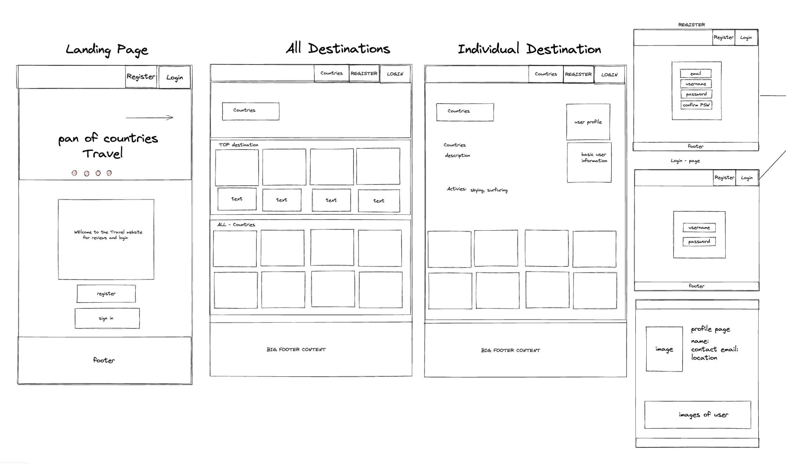
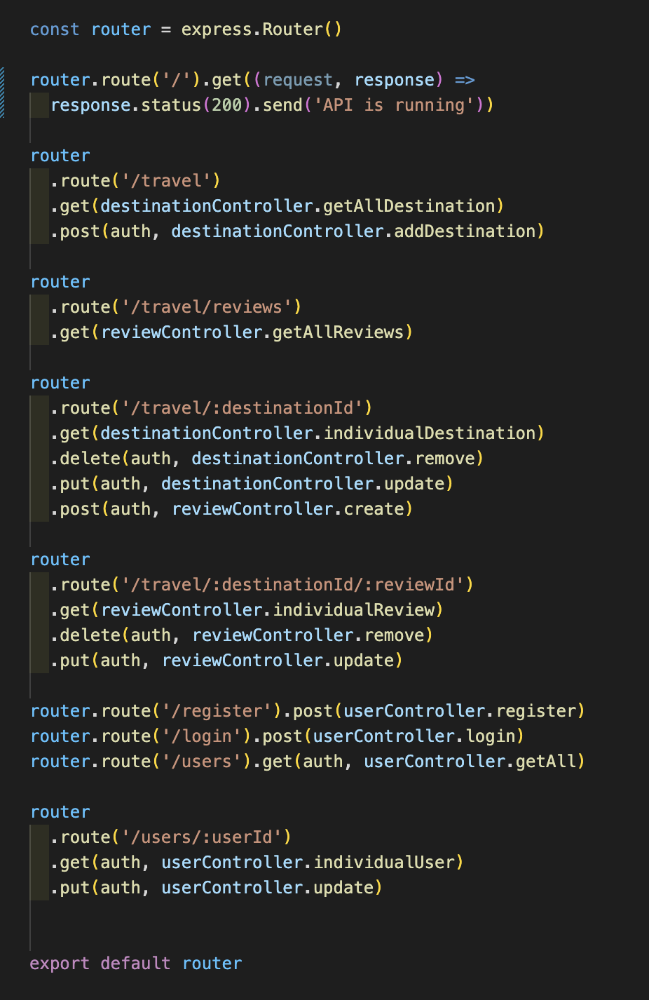
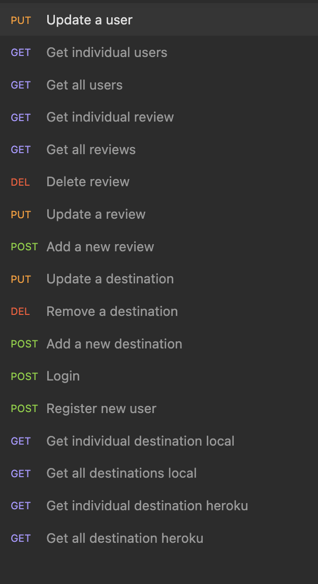
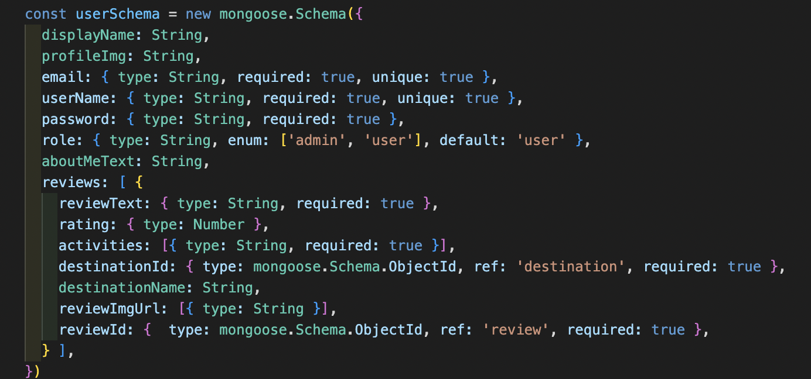
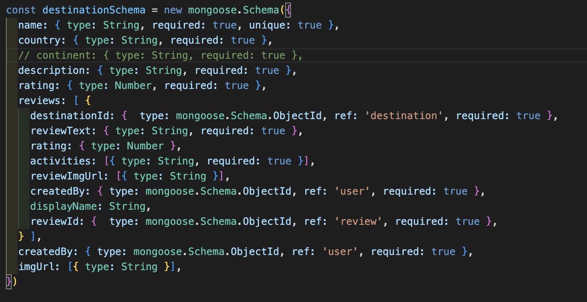
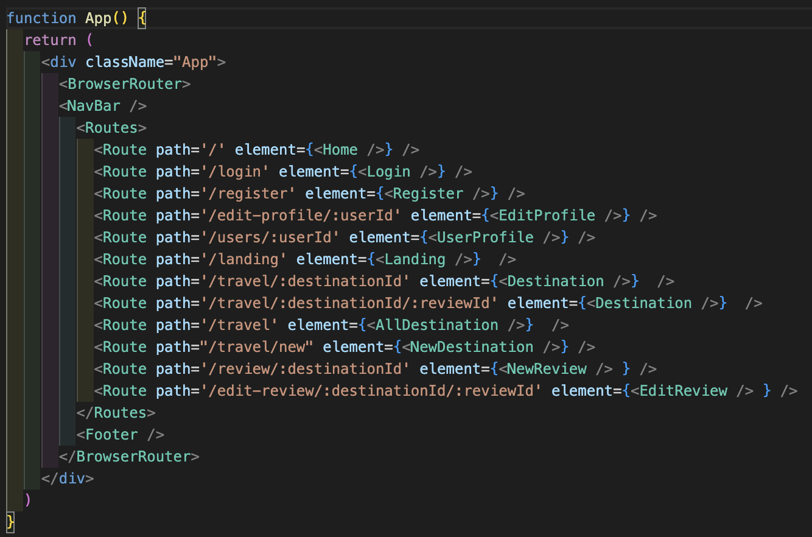
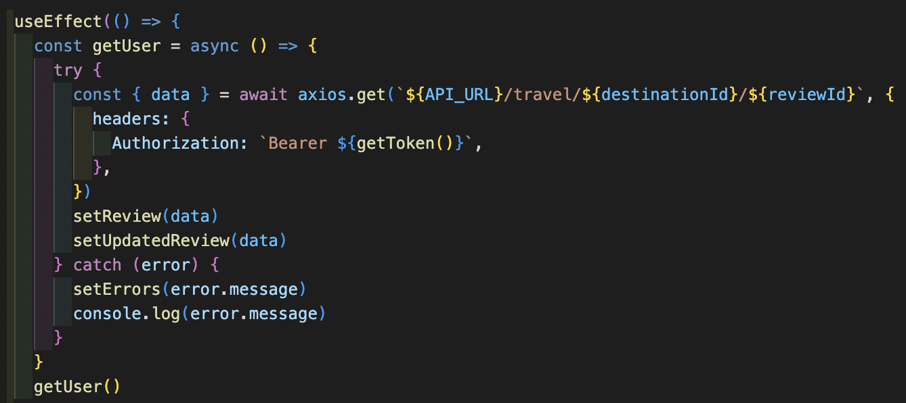
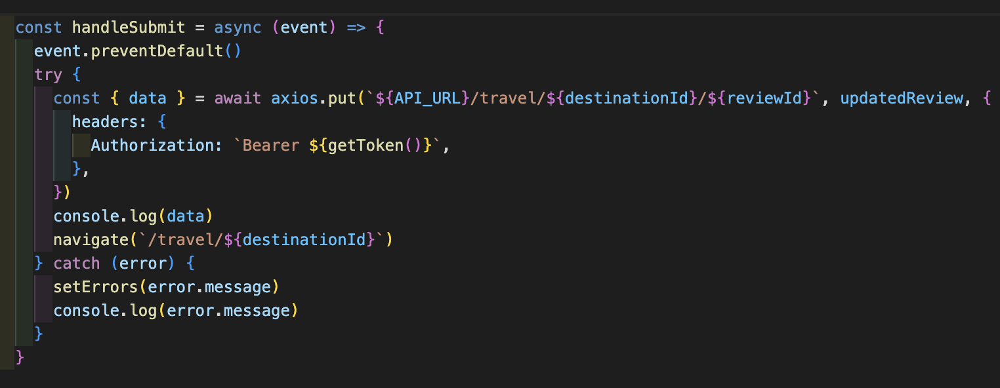
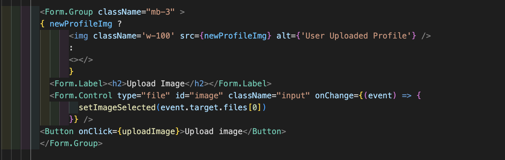

# Exploradex: A MERN Stack Application

# Table of contents
* [Project Overview](#project-overview)
* [Deployment Link](#deployment-link)
* [Timeframe and Team](#timeframe-and-team) 
* [Technologies Used](#technologies-used)
* [Brief](#brief) 
* [Planning](#planning)
* [Build Process](#build-process)
* [Challenges](#challenges)
* [Wins](#wins)
* [Key Learnings](#key-learnings)
* [Bugs](#bugs)
* [Future Improvements](#future-improvements) 

# Project Overview

This is the third project I did for a Software Engineering Immersive course through General Assembly London. I worked with [Serhan Miah](https://github.com/SerhanMiah) and [Chris Rainey](https://github.com/chrainey). Exploradex is a travel site where users can explore destinations, leave reviews, and upload photos of destinations they have explored. Users register and create a profile. Their reviews are displayed on their profile page to show where they’ve traveled, as well as on the destination’s page. 

# Deployment Link

The app has been deployed with Netlify and Heroku is available [here.](https://sei65-destinations.netlify.app/)

# Timeframe and Team

* 7 day timeframe
* Serhan Miah (https://github.com/SerhanMiah)
* Chris Rainey (https://github.com/chrainey)

# Technologies Used 

__Front-End__

* Axios
* Buffer
* Cloudinary
* CSS3
* HTML5
* JavaScript
* JSX
* Node.js
* React Bootstrap 
* React Router DOM
* React.js
* Sass

__Back-End__ 

* AWS S3
* Bcrypt
* Buffer
* CORS
* Dotenv
* Express
* Insomnia
* JSON Web Token
* MongoDB
* Mongoose
* Node.js

__Deployment__ 

* Heroku 
* Netlify 

__Other__

* Chrome developer tools
* Excalidraw
* Git & GitHub

# Brief

* Build a web application using the MERN stack: creating both the frontend and the backend, using Express API to serve the data from a Mongoose database.
* Developing the frontend with React.js using the created API.
* The API should have multiple relationships and CRUD functionality for at least a couple of models.

# Planning

* We defined our minimum viable product and stretch goals then, we used Excalidraw to make wireframe sketches. This allowed us to agree on a layout of how we wanted the app to look and function as users navigate through it. We wrote pseudocode of the user and destination models to plan data relationships and link them with what we want to display on each page. 

* Minimum Viable Product (MVP): 
	* User can register, login, and logout
	* Create at least 30 destinations in seed data
	* All destinations displayed and user can navigate to individual pages
	* User can create a profile
	* User can add new destinations 
	* User can leave reviews on destinations
* Stretch Goals:
	* Add a map location to destination
	* Add a weather chart 
	* Upload images with reviews and on user profile

* We used a shared Google Doc to track our progress and share ideas and notes. Each morning, we planned what needed to get done and set goals to accomplish for the day. We used Git and GitHub for version control. After some GitHub struggles, to stay on the same page we did pushes and pulls together in the morning and resolved any merge conflicts as a group. We all worked on each aspect of the project but Kate did backend and linking to frontend, while Serhan and Chris created the components of the frontend and styling. 

# Build Process

* We spent the first 2 days building the back-end, and the remainder of the week building the front-end and tweaking the database models and end-points as we needed. 

__Back-End__

* Chris and Serhan gathered seeding data. Having a visually appealing site was important for us, and our wireframes involved large images. So, a healthy amount of time was spent finding quality images. 

* I built using Node.js, Express, and MongoDB. I built the following components: express routes, models for users, destinations, and reviews, as well as controllers for authorization, users, destinations, reviews, and error handlers. I tested all the endpoints in Insomnia to make sure the CRUD functionality worked as it was intended. I took the images they gathered and used Amazon Web Services (AWS) S3 to host them and add to seeding data. I deployed to Heroku the first day I created the back-end, and then redeployed the updated files as the project went on. 

* Here are screenshots of the back-end express routes linking the client-side paths to their corresponding HTTP requests, and the insomnia requests used to test each path: 

  * Express Routes

  * Insomnia Requests

* The code below shows the user and destination schemas. There were relationships between the users, reviews, and destinations. The reviews were embedded in both the user and destination so that only one request had to be made to get all the necessary information to display on the user profile page and the individual destination pages. 

  * User Schema

  * Destination Schemia

__Front-End__

* Serhan made the framework of the app, creating the main components based on the Excalidraw wireframes. He also set up a Cloudinary account and used their imageUpload function to allow users to upload images. Chris built the homepage, with a hero image carousel for each destination page. He also did the majority of the styling using React Bootstrap and SASS.
* Once data was completed and seeded, I created all the paths and Axios requests using React. I had created all the routes on the backend, so I knew which paths corresponded to which HTTP Requests. Below is a screenshot of all the possible client-side paths and the React components they navigated to.

  * Front-End Routes

* Each component on the front-end had an Axios request on page load like the get request below.

  * Axios Get Request

* I made the forms to edit the user profile and reviews. On submit, the forms triggered a handleSubmit function that used an Axios put request like the example below:

  * Axios Put Request

# Wins

* To host the images, I spent a day teaching myself to use Amazon Web Services S3. I created a bucket for the project and uploaded our images, then made the permissions for the bucket public access. I experimented with using Cloudinary to host the seed data images, but I thought AWS was better for our needs. I was able to upload entire folders where the hosted image URLs began with the same start and ended with their file paths within the folder, so it was easy to generate the URLs knowing the folders and filenames. It was faster than Cloudinary which would have had unique URLs for each image.

* I was happy with how I was able to get a preview of an uploaded image to display on the page, because it was a simple piece of code that worked well. I set up a UseState for uploaded images and a useEffect to listen for changes in the state. Below is a screenshot of the ternary I added to the page JSX so that on the re-render, if there was an image it would display as a preview before submitting the form.

  * Upload Image Preview

# Challenges 

* Embedding the review inside the user and the destination schemas:
I thought this would be faster overall because when loading the user profile or individual destination pages, there would only be 1 Axios request to get all the necessary data. It made creating, removing, and updating more difficult because the models for the user, destination, and review all had to be changed. 
* Learning curve with GitHub: 
We had a few instances of accidentally working on the main branch rather than on a feature branch. A few times, styling using React Bootstrap was added to pages after the functionality had been set up and working. Functionality wasn’t tested again before the styling branches were merged into main and we had to backtrack and figure out what changes broke the code. We started pushing code together in the morning, and then all pulling down updated code to avoid mistakes.

# Key Learnings

* I feel more confident in my abilities after this chance to integrate everything I’ve learned about the back and front-end together.
* More stringent project planning would have helped us with our working timeline of prioritizing and delegating tasks. Some time was lost looking into implementing stretch goals before the minimum viable product had been completed. If we could do this again, I would have spent extra time making a more detailed plan with a day-by-day timeline and individual goals along the process. 

# Bugs

* If a user adds a new destination, there is only 1 image but the carousel is still there with 2 empty spots for images. 
* When a user updates their display name, their reviews on the destination page aren’t updated with the new name.
* This is not exactly a bug, but the key and username for Cloudinary should be kept private in an environment variable.

# Future Improvements

* Things that could be added in the future:
	* Search bar for destinations
	* Add continent and create a drop-down menu to filter
	* Calculate overall rating score for destination from average of user review ratings
	* Ability to upload more than 1 image for a review
	* Add the user uploaded images of destination to the carousel
	* Use MapBox to display maps of locations

